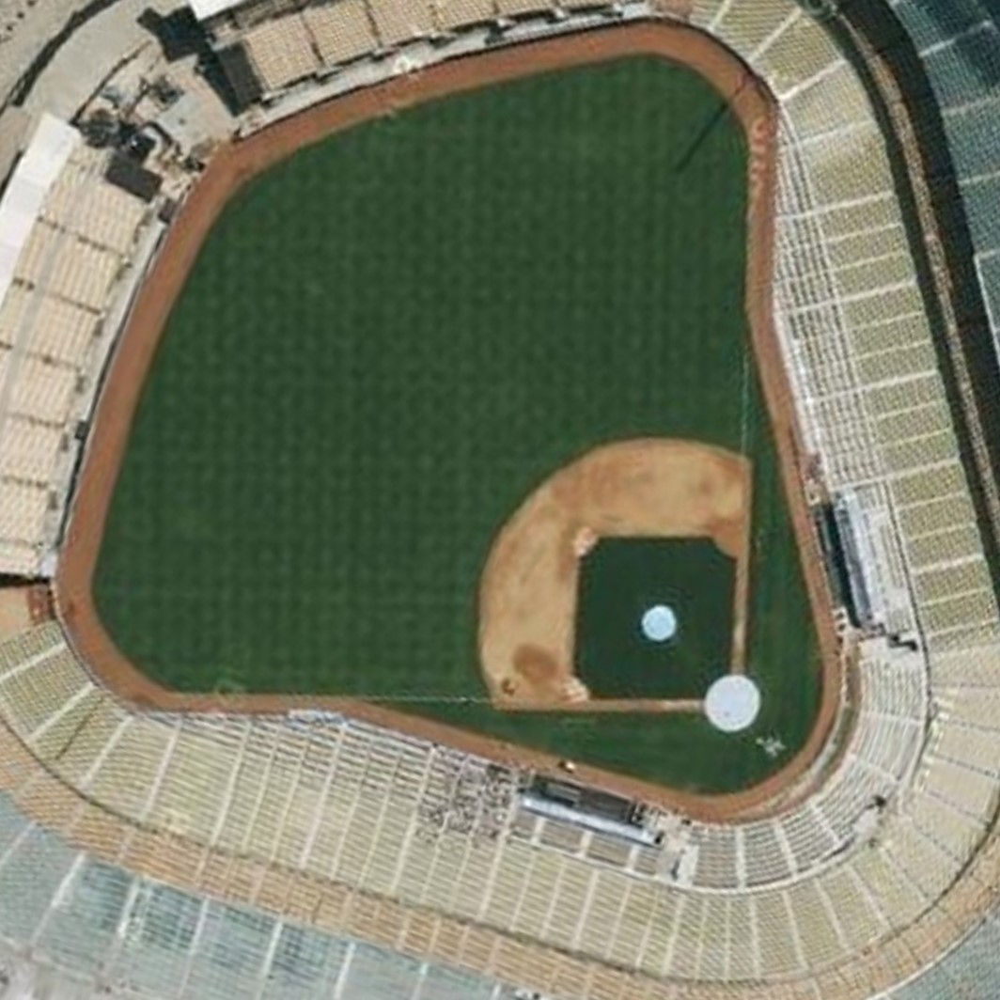

```{r setup, include=FALSE}
knitr::opts_chunk$set(echo = TRUE, message = FALSE,
                      warning = FALSE)
```
#### PSTAT 131 Fall 2022
## Introduction

This project is designed to create a statistical model that predicts the chances of a Major League Baseball team winning a game. Since we are determining either winning or losing, this project will use a binary classification approach. For this project, the team I wanted to test this model with the Los Angeles Dodgers, because my family and I are huge fans of them. These are the packages required for the project
```{r}
library(tidymodels)
library(ISLR)
library(ISLR2)
library(tidyverse)
library(glmnet)
library(corrr)
library(corrplot)
library(ggplot2)
library(janitor)
library(dplyr)
library(stringr)
library(MASS)
library(knitr)
library(visdat)
library(readr)
library(parsnip)
library(discrim)
library(kknn)
library(ranger)
tidymodels_prefer()
```


### What is the MLB?
If you have never heard of the MLB before or just need a quick reminder, here's a brief summary. The MLB or 'Major League Baseball' is a professional baseball organization located in North America. Even though it is only in North America, the MLB is the  It has 30 teams, 29 in the USA and 1 from Canada, which compete every year during the MLB season. This culminates into the World Series near the end of the year, where the best teams of the season compete to be the World Series champion.


### What's the purpose of the model?
For people not familiar with Baseball, or for those who do not completely immerse themselves in baseball analytics and theory crafting for future baseball games, it might be confusing how one baseball team will perform in the future. If you are rooting for a team, wouldn't it be interesting to find out what it is that makes that team succeed? This is what I want to find out with this project. To see if there is a certain variable or situation that improve a team's chances of winning a game. By the end of this project, I hope to give some insight for fans what indicates better chances of winning an game in the MLB. 

### The Plan
In this project, I will be using the `'mlb-elo'` data set from fivethirtyeight.com. It contains data from every MLB game since 1871! The data set is available for download at [github](https://github.com/fivethirtyeight/data/tree/master/mlb-elo). To begin, the data will be cleaned and altered to fit better into the model later. After the data has been explored, I can use the different variables in the data set as 'predictor variables' which I will use to predict the chances of winning. Afterwards, I will split the data into training and test sets, create a recipe for the model, and use a 10-fold cross validation. For the models, Logistic Regression, Linear Discriminant Analysis, Lasso, K-nearest numbers, and Random forest models will be used to for the data. In the end, when all the models have been tested, I will use the most effective model on the testing data set to see how accurate my model is. If some of these terms seem a little confusing right now, we will go over each one as we go along.


## Exploratory Data Analysis

Once we load in the data, we need to check how it looks starting out. There can be variables that are in a form we cannot use yet, as well as some possible missing data. This is the point of cleaning and manipulating the data before we do anything else with it.

### Data cleaning and Manipulation

Lets begin by loading in the data set from the project github.

```{r}
mlb_elo <- read_csv("mlb_elo.csv")
head(mlb_elo)
```
Additionally, we can check the dimensions of the data set as we load it in
```{r}
dim(mlb_elo)
```


It looks like the data loaded in just fine. There are 225,897 observations, with 26 different variables. However, this data includes games from all of the teams in the MLB. In order to get data for only the dodgers, we need to change the set a little bit.

```{r}
dodger_elo <- mlb_elo %>%
  filter(team1 == 'LAD' | team2 == 'LAD')
head(dodger_elo,10)
```
Now the data set only includes games with the dodgers either in the home  or away teams. How big is the data set now?

```{r}
dim(dodger_elo)
```
There's now only 21,588 observations, which is still a very big data set. Let's start checking for any inconsistent data. We'll see if any data is missing first.
```{r}
vis_miss(dodger_elo)
```

Looks like the variables `playoff` and some pitcher variables are missing in the data set. Seeing how 98% of `playoff` is missing, it would be safe to get rid of that variable before we fit the data. As for the rest of the missing data, all of the observations in the pitcher variables are at the end of the data set. Since the data is ordered chronologically (as seen with the most recent games being shown in the `head` function), we can focus on the more recent observations. I think that the games from more recent years will have more influence on predicting win chances, since players, coaches, and even the game have all changed since the beginning.

```{r}
tail(dodger_elo)
```

From the `date` variable, we can see that the earliest game recorded is from 1884. It would be safe to say that we can discard many of the earlier years of baseball for the model. To simplify it for the model, we can use baseball games starting after 2000.

```{r}
dodgerRecent_elo <- dodger_elo %>% 
  filter(season >= 2000)
head(dodgerRecent_elo)
```
Let's make sure it starts at 2010 and see how big the data set is.
```{r}
tail(dodgerRecent_elo)
dim(dodgerRecent_elo)
```
It looks like everything is in order. Now there are only 3747 observations in the data set.

### Adding more variables


```{r, }
dodger_wl <- dodgerRecent_elo %>% 
  mutate(dodger_result = case_when(team1 == 'LAD' & score1 > score2 |
                                   team2 == 'LAD' & score2 > score1 ~ 0,
                                   team1 == 'LAD' & score2 > score1 |
                                   team2 == 'LAD' & score1 > score2~ 1))
```

This code created our response variable, `dodger_result`, which is 0 if the Dodgers win, and 1 if they lose. I want to also simplify another variable, which is whether or not the Dodgers are at a home or away game. In this variable, 0 means that it's a home game, and 1 means it's an away game. Also, for ease of understanding, the Dodgers ELO rating and Pitcher Rolling game score will be put in their own columns as well

```{r}
dodger_wl <- dodger_wl %>% 
  mutate(h_a = case_when(team1 == 'LAD' ~ 0,
                         team2 == 'LAD' ~ 1))
dodger_wl <- dodger_wl %>% 
  mutate(dodger_rating = case_when(team1 == 'LAD' ~ rating1_pre,
                                   team2 == 'LAD' ~ rating2_pre))
dodger_wl <- dodger_wl %>% 
  mutate(dodger_pitcher = case_when(team1 == 'LAD' ~ pitcher1_rgs,
                                    team2 == 'LAD' ~ pitcher2_rgs))
```

Now with the addition of these four variables, lets check again for any missing data.

```{r}
vis_miss(dodger_wl)
```
### Choosing our predictor variables
Okay, looks like all of the missing data is within the `playoff` variable. At this point, we can choose the variables that are most important for this project. In order to choose, I wanted to eliminate any variables that didn't have any significance before the game, so things such as a post game elo score or the final score of the game would be pointless in predicting the result of the game before it began. In short, the variables that need to be chosen should be known before a game begins, and isn't completely missing. These are the variables chosen:

* `season` - Year of season
* `neutral` - If the game was on a neutral site
* `team1` - Home team
* `team2` - Away team
* `elo_prob1` - Home team probability of winning according to ELO rating
* `elo_prob2` - Away team probability of winning according to ELO rating
* `rating1_pre` - Home team ELO rating
* `rating2_pre` - Away team ELO rating
* `pitcher1_adj` - Home starting pitcher's adjustment to their team's rating
* `pitcher2_adj` - Away starting pitcher's adjustment to their team's rating
* `rating_prob1` - Home team's win probability with team ratings and starting pitchers
* `rating_prob2` - Away team's win probability with team ratings and starting pitchers
* `h_a` - Whether it is a home or away game for the Dodgers
* `dodger_rating` - Dodgers ELO rating
* `dodger_pitcher` - Dodgers Pitcher's rolling game score 

At this point, it might be a little confusing on what exactly the ELO ratings mean. Basically, it was a rating system used by the website I received the data from, fivethirtyeight.com. It is like a mini prediction system itself, ranking based off of things like home-field advantage, travel, rest, starting pitchers, and more. I want to also see in this project if this ELO based system reflects the ability of the team as well. More information about fivethirtyeight's ELO rating can be found [here](https://fivethirtyeight.com/features/how-our-mlb-predictions-work/).

### Cleaning our data set

Now that we know our variables, we now want to only include those variables inside the data set. Additionally, we want 'coded' and character values such as `h_a`, `season` and `pitcher1` to be categorical variables, so we will factorize those as well.
```{r}
dodger_data <- dodger_wl %>% 
  select(season, neutral, team1, team2, elo_prob1, elo_prob2, 
         pitcher1_adj, pitcher2_adj, rating1_pre, rating2_pre, rating_prob1, rating_prob2,
         dodger_result, h_a, dodger_rating, dodger_pitcher)
dim(dodger_data) #Check how many variables there are
```
So now, the data set only has 16 variables, which is 15 predictor variables plus the response variable `dodger_result` . Now we can convert some of the variables to factors:
```{r}
dodger_data$season <- as.factor(dodger_data$season)
dodger_data$neutral <- as.factor(dodger_data$neutral)
dodger_data$team1 <- as.factor(dodger_data$team1)
dodger_data$team2 <- as.factor(dodger_data$team2)
dodger_data$dodger_result <- as.factor(dodger_data$dodger_result)
dodger_data$h_a <- as.factor(dodger_data$h_a)

#Assigned all variables to be a factor type
```

### EDA Visuals

Now that the data is ready, we can make some plots to see the relationship between all of the variables in the data set. 

### Correlation Plot

Let's see how a correlation plot heat map to see the general relationship of variables.

```{r}
#Correlation Matrix
dodger_data %>% 
  select(where(is.numeric)) %>% 
  cor() %>% 
  corrplot(type = 'lower', diag = FALSE, method = 'square')
```
Looking at the correlation matrix, there is a clear checker-like pattern between variables. This is because of the variables directly opposing each other. For example, take a look at the second last row, where the variable `rating_prob1` is compared to the others. It has a positive relationship with `elo_prob1`, and then a negative relationship with `elo_prob2` at a similar magnitude. The pattern repeats for the rest of the variables down the row. Variables related to the team at place 1 are positively correlated with other variables at place 1, while they are negatively correlated with variables from another team. The same is said for variables about team 2 as well. Basically what I get from this graph is that variables relating to the same team are positively correlated, and variables of opposing teams are negatively correlated with a similar magnitude to the other variable in the pair. Variables such as `pitcher1_adj` and `pitcher2_adj` have no relationship at all, which makes sense. A pitcher's effect on their team shouldn't affect another pitcher's effect on their team. One more thing I want to point out is the positive relationship between `dodger_pitcher` with `pitcher1_adj` and `pitcher2_adj`. There is a positive correlation between the adjustment and rolling game score for a pitcher on a team. What this shows is that as a pitcher's rolling game score increases, so does the effect on the adjustment to their team's overall rating. Basically, it seems that pitchers have a significant role when figuring out a teams overall score.

### Season

Let's the the Dodger's game result history through the years. We can do this by making a bar plot showing the number of wins and losses each year. For ease of understanding, the blue bar shows wins while the red bar shows losses. Overall, we see that the total amount of games played is about the same for all the years, except for 2020, which is understandable considering the high quarantine measures that year. The ratio of wins and losses seems to be about 50:50 in the earlier years, while more recent years have more wins than losses.

```{r}
ggplot(dodger_data, aes(y = season)) +
  geom_bar(aes(fill = dodger_result)) +
  scale_fill_manual(values = c('#005A9C','#EF3E42'))
```

### Home vs Away

Next, I want to plot the game history again, but this time comparing the home and away games' win loss rate. 0 in the `h_a` variable is for home games, and 1 is for away games.

```{r}

ggplot(dodger_data, aes(y = h_a)) +
  geom_bar(aes(fill = dodger_result)) +
  scale_fill_manual(values = c('#005A9C','#EF3E42'))
```

Comparing the bars, it looks like home games have a greater amount of wins compared to away games. Although it doesn't look like much, there is about a 250 game difference between wins and losses. From the data, it seems like the dodgers do have a home field advantage.

### Games vs ELO Rating

To see if team rating really showed the strength of the team, here's a graph. If a team's ELO rating had a strong reflection of their strength, the graph would show more wins with a higher rating, and less wins with a lower rating.

```{r}
 ggplot(dodger_data, aes(x = dodger_rating)) +
  geom_histogram(aes(fill = dodger_result)) +
  scale_fill_manual(values = c('#005A9C','#EF3E42'))
```
Looking at the graph, it looks like what I thought was generally true. The left end of the graph has more bars that have less blue compared to the bars on the right. Basically, for each bar, there is a bigger blue to red ratio as you go to the right. This means that as the Dodger's ELO rating goes higher, they will have more wins. 

## Model setup

After exploring the data, we have some variables that might be good indicators on winning a game. Now, we can split our data into training and testing sets, and use cross validation to build our models. 
### Splitting the data
For machine learning, we split our data into two sets, training and testing. The training set, like the name suggests, trains the model we make by 'learning' the data. Once it has been trained, we test the effectiveness of the model with the testing set. I want to split the data with 80% for training and 20% for testing. This is because I want the model to have much more observations to learn from. To make sure we use the same split for the rest of the models here, a random seed will be chosen.

```{r}
#setting the seed
set.seed(7452)
dodger_split <- dodger_data %>% 
  initial_split(prop = 0.8, strata = 'dodger_result') #split the data

dodger_train <- training(dodger_split) #training set
dodger_test <- testing(dodger_split) #testing set
```

Lets check if the split was correctly 80/20
```{r}
dim(dodger_train)
```
```{r}
dim(dodger_test)
```
2997 observations out of 3747 total is about 0.80 percent of the data. 750 observations out of 3747 is about 0.20 percent of the data. Those are the correct proportion, and are still an adequate amount for building a model.

### Building a recipe

Now, a recipe is needed for all of the models we are using. Since we are using the same data set for all of the models, we only need to make one recipe. The recipe is like a guide that all of the models follow. In basic terms, it tells the model, 'this is what you are trying to predict, and you use all of these variables as the predictors'. Each model will use the predictors in different ways, but they will all follow the general rules. Also, we will dummy code all of our variables that we turned into factors. This will let us use categorical data in this model.

```{r}
dodger_recipe <- recipe(dodger_result ~ season + neutral + team1 + team2 + elo_prob1 + elo_prob2 + pitcher1_adj + pitcher2_adj + rating1_pre + rating2_pre + rating_prob1 + rating_prob2 + h_a + dodger_rating + dodger_pitcher, data = dodger_train) %>% #Recipe to be used
  step_dummy(all_nominal_predictors()) %>% 
  step_normalize(all_predictors()) #Standardize all predictors
```

### Cross Validation
Cross validation is used to protect the model from overfitting any data. In this case, it will split the training set into 10 'folds', which are smaller, equally proportional testing sets. They are then stratified with the response variable `dodger_result`.
```{r}
dodger_folds <- vfold_cv(dodger_train, v = 10, strata = dodger_result)
#Cross validation with 10 folds
```

Lastly, to have the same information for every model, the training folds, recipe, and training set will be saved into a folder in the project directory.
```{r}
save(dodger_train, dodger_test, dodger_recipe, dodger_folds, file = 'model-data/model.rda')
```

## Building our Models

Load up our Recipe, training and testing sets, and folds
```{r}
load('/Users/alcal/Desktop/PSTAT131-Final/model-data/model.rda')

```


Now we have everything we need to start building our models. From the beginning, I wanted to try out 4 different models using the same recipe. Each model has the same process of building which goes like this:

1. Set up the model type, engine, and mode
2. Set up a workflow and add the model
3. Fit the model and workflow to the training set

For some of the models we are fitting, there are a few extra steps between 2 and 3. It concerns tuning the model parameters. These are the extra steps:
2_1. Make a tuning grid with chosen parameters for tuning.
2_2. Tune the model with the parameters
2_3. Select the best model chosen out of all the tuning combinations

### Logistic Regression Setup

Logistic regression predicts between two different states, true or false. In this case, it's either win or lose. Logistic regression tries fitting a curve to the predictor variables to try and predict the result of the game.

Here's the code for setting up a logistic regression model:
```{r, eval = FALSE}

log_reg_model <- logistic_reg() %>% #Model Setup
  set_engine('glm') %>% 
  set_mode('classification')

log_workflow <- workflow() %>% # Set up workflow
  add_recipe(dodger_recipe) %>% 
  add_model(log_reg_model)
```

### Linear Discriminant Analysis Model Setup

Linear Discriminant analysis takes the known categories of the variables, and tries to best separate each observation to the response variable. In this case, it reduces all of the predictor variables into one line, where it can maximize the distance between means. In this case, it wants to maximize the distance between the mean wins and mean losses. 
```{r, eval =FALSE}

control <- control_resamples(save_pred = TRUE)
lda_model <- discrim_linear() %>% 
   set_mode('classification') %>% 
   set_engine('MASS')
 

lda_workflow <- workflow() %>% 
  add_recipe(dodger_recipe) %>% 
  add_model(lda_model)
```

### Elastic Net Model (Lasso) Setup

Lasso regression uses what is called variable selection and regularization to improve it's prediction accuracy. Regularization means that the model is choosing which variables affect the model the most, and dropping those that have comparatively little effect.

```{r, eval = FALSE}

elastic_net_spec <- multinom_reg(penalty = tune(),
                                 mixture = tune()) %>% 
  set_mode('classification') %>% 
  set_engine('glmnet')

en_workflow <- workflow() %>% 
  add_recipe(dodger_recipe) %>% 
  add_model(elastic_net_spec)

en_grid <- grid_regular(penalty(range = c(-5,5)),
                        mixture(range = c(0,1)), levels = 10)
```

### K Nearest Neighbors Model Setup

For K nearest neighbors models, it is pretty simple. It predicts if a certain point of data will be classified a win or lose depending on which group of data points it is nearest to. Like the name says, the model looks for the 'nearest neighbors' to the data and classifies them accordingly.
```{r, eval = FALSE}

knn_model <- nearest_neighbor(
      neighbors = tune(),
      mode = 'classification') %>% 
  set_engine('kknn')

knn_workflow <- workflow() %>% 
  add_recipe(dodger_recipe) %>% 
  add_model(knn_model)

#Set up tuning parameters
knn_tune <- parameters(knn_model)
#Set up grid
knn_grid <- grid_regular(knn_tune, levels = 2)
```

### Random Forest Model Setup

Random forest models use a tree based system to classify the observations. The 'forest' is made with random subsets of the data set. These subsets then create an output. As these outputs are made, a majority decision classifies the trees as what was the majority output. In this projects terms, it's as if a number of samples were chosen from the testing set, which creates a decision tree and determines the class of the tree as 'win' or 'lose'. The final output of the random tree will be shown as whatever the majority class was chosen. So if the majority were 'win', the final output would be 'win'.

```{r, eval = FALSE}

rf_model <- rand_forest(min_n = tune(),
                        mtry = tune(),
                        mode = 'classification') %>% 
  set_engine('ranger')

rf_workflow <- workflow() %>% 
  add_recipe(dodger_recipe) %>% 
  add_model(rf_model)

rf_tune <- parameters(rf_model) %>% 
  update(mtry = mtry(range= c(2,92))) #Set up tuning parameters
#Set up grid
rf_grid <- grid_regular(rf_tune, levels = 2)
```
We will save the setup for later
```{r, eval = FALSE}
save(rf_model, rf_workflow, rf_tune, file = 'model-data/rf-setup.rda')
```


### Fitting Models

#### Logistic Regression Fitting

```{r, eval = FALSE}

log_fit <- fit_resamples(log_workflow, dodger_folds)
```
```{r, eval = FALSE}

save(log_fit, file = 'model-data/log-fit.rda')
```

#### Linear Discriminant Analysis Fitting

```{r, eval = FALSE}

lda_fit <- fit_resamples(resamples = dodger_folds,
                         lda_workflow)
```
```{r, eval = FALSE}

save(lda_fit, file = 'model-data/lda-fit.rda')
```

#### Lasso Model Fitting 

To fit tuned models, the function `tune_grid()` is used.
```{r, eval = FALSE}

tune_res <- tune_grid(
  en_workflow,
  resamples = dodger_folds,
  grid = en_grid
)
```

```{r, eval = FALSE}

save(tune_res, file = 'model-data/tune-res.rda')
```

#### K Nearest Neighbors Model Fitting

Once the parameters are set up, we fit the model.
```{r, eval = FALSE}

knn_res <- knn_workflow %>% 
  tune_grid(resamples = dodger_folds,
            grid = knn_grid)
```
```{r, eval = FALSE}
save(knn_res, knn_grid,knn_tune, file = 'model-data/knn-res.rda')
```


### Random Forest Model Fitting

```{r, eval = FALSE}

rf_res <- rf_workflow %>% 
  tune_grid(
    resamples = dodger_folds,
    grid = rf_grid)
```
```{r,  eval = FALSE}
save(rf_res, rf_grid, rf_tune, file = 'model-data/rf-res.rda')
```

## Model Results

When we look at the results of the models, we want to take note of the `roc_auc` value in each of the results. The higher the number, the better the model is at predicting the result of a game. Lets start by loading in all of the fitted models. These take a lot of time to run, so they have been previously prepared so that they are not run every time this project is saved.

```{r}
load('/Users/alcal/Desktop/PSTAT131-Final/model-data/log-fit.rda')
load('/Users/alcal/Desktop/PSTAT131-Final/model-data/lda-fit.rda')
load('/Users/alcal/Desktop/PSTAT131-Final/model-data/tune-res.rda')
load('/Users/alcal/Desktop/PSTAT131-Final/model-data/knn-res.rda')
load('/Users/alcal/Desktop/PSTAT131-Final/model-data/rf-res.rda')
```

### Logistic Regression

```{r}
log_metrics<- collect_metrics(log_fit)
log_metrics
```
For Logistic regression, the `roc_auc` turned out to be 0.5813. Basically, after being trained on the training set, this model predicts the result of a game correctly about 58% of the time. 

### Linear Discriminant Analysis

```{r}
lda_metrics <- collect_metrics(lda_fit)
lda_metrics
```
For LDA, the `roc_auc` is 0.5818. This value is very similar to logistic regression, but this one is better by about 5 hundredths of a percent, so about the same here.

### Plot for Elastic Net (Lasso)
```{r}
autoplot(tune_res)
```
In this graph, we can see each ten different colored lines on two graphs, each line represents a different lasso penalty value chosen. In general, it looks like lower penalty values lead to higher `roc_auc` on the second graph. Lets see what model combination is the best

```{r}
best_fit_en <- show_best(tune_res, metric = 'roc_auc') %>% 
  select(-.estimator, .config) %>% 
  slice(1)
best_fit_en
```
From the `.config` column, it seems that model number 93 is the best performing. It has an `roc_auc` value of 0.5852, which is the highest number so far. However, it's still very close to Logistic Regression and LDA.


### Plot for KNN

```{r}
autoplot(knn_res)
```
This graph's best `roc_auc` is at around 0.52, which is the lowest number yet. Here is the best fitting model:
```{r}
best_fit_knn <- show_best(knn_res, metric = 'roc_auc') %>% 
  select(-.estimator, .config) %>% 
  slice(1)
best_fit_knn
```
It looks like K nearest numbers is the worst performing one so far. With an `roc_auc` of about 0.5219, it is around 6 percentage points behind the rest. However, it is not so far behind that it is completely lost in predicting the game result.

### Plot for Random forest

```{r}
autoplot(rf_res)
```
What's the best random forest model?
```{r}
best_fit_forest <- show_best(rf_res, metric = 'roc_auc') %>% 
  select(-.estimator, .config) %>% 
  slice(1)
best_fit_forest
```
It looks like random tree model 3 was the best performing, with an ROC AUC of 0.5867, the highest number yet.


### Summary of all ROC_AUC

I wanted to get a graph that quickly showed all of the different `roc_auc` between models. This should give a clear idea as to what model works the best, and which performs the worst.

```{r}
log_auc <- log_metrics$mean
log_auc <- log_auc[2]
lda_auc <- lda_metrics$mean
lda_auc <- lda_auc[2]
tune_auc <-best_fit_en$mean
knn_auc <-best_fit_knn$mean
rf_auc <-best_fit_forest$mean 
Model <- c('log_reg','lda','lasso','knn','random_forest')
auc <- c(log_auc,lda_auc,tune_auc,knn_auc,rf_auc)
```
Bar plot of the data:
```{r}
all_auc <- data.frame(Model,auc)
ggplot(all_auc, aes(x = Model, y = auc)) +
  geom_bar(stat = 'identity', color ='black', fill = 'blue') 
```
Dot plot of `roc_auc`
```{r}
ggplot(all_auc, aes(x=auc, y=Model)) +
  geom_dotplot(binaxis = 'y',stackdir = 'center')
```
From these graphs, it is evident that random forest has the best chances of predicting the result of a baseball game for the Dodgers.

## Building the Final Model

Now that we know our best model, we can create one last workflow that is tuned to the best parameters in the random forest.

```{r}
load('/Users/alcal/Desktop/PSTAT131-Final/model-data/rf-setup.rda')

rf_workflow_final <- rf_workflow %>% 
  finalize_workflow(select_best(rf_res, metric = 'roc_auc'))
```

Now there's only the final fit to make the model
```{r}
rf_final_fit <- fit(rf_workflow_final, data = dodger_train)
```

### Testing the Test Set

Now we can finally see how our chosen best model predicts data from the testing set.
```{r}
predictions <- augment(rf_final_fit, new_data = dodger_test) %>% 
  select(dodger_result, starts_with('.pred'))
predictions
```

Before we see the overall ROC AUC on the testing set, lets check out the plot for `roc_auc`. A plot of `roc_auc` should look like an upside down L. The more it looks like a right angle, the better the model is at predicting the response variable. Basically, we want it to look more and more like the field at Dodger Stadium.



```{r}
dodger_roc_plot <- augment(rf_final_fit, new_data = dodger_test) %>%
  roc_curve(dodger_result, estimate = .pred_0)
autoplot(dodger_roc_plot)
```

From the looks of the graph, it doesn't look like it predicts very well. Instead of something similar to an upside down L, it looks more like a slanted longbow. However, that was to be expected. None of the models that were fitted went above 60% accuracy, and the best training set had `roc_auc` at around 58%. To compare, a prediction rate of exactly 50% would look like a diagonal line, where the dotted line on the graph is. Let's see what the actual `roc_auc` value is.
```{r}
final_roc_auc <- augment(rf_final_fit, new_data = dodger_test) %>%
  roc_auc(dodger_result, estimate = .pred_0) %>% 
  select(.estimate)

final_roc_auc
```
The final prediction score for the model came out to 0.5974, or 59.74%. Surprisingly, the model was slightly better than the training set. This means that the model created is about 59 percent accurate in determining the result of a game with the LA Dodgers.

## Conclusion

With lots of data analysis, testing, and research, it turns out that Random Forest models are the best at predicting if the Dodgers will win a game. However, it was nowhere near perfect.

After making the model, It seems that with the data provided, it is difficult to predict the result of a baseball game. One more thing I wanted to look at was the confusion matrix of the results.

```{r}
predictions %>% 
  conf_mat(truth = dodger_result, estimate = .pred_class) %>%
  autoplot(type = "heatmap")
```

To interpret this, the columns are the true values of each observation. Meanwhile, the rows show which value the model chose. Basically, if the model chose the correct value, it would line up either in the top left or bottom right. The other two squares mean that the model chose a false win or a false loss. The number inside the squares show how many times the model chose that specific combination. Also, it looks like the model really likes predicting wins over losses, with 658 total predictions of 'win' and only 92 predictions of 'lose'. Looking back at the EDA graphs, the Dodgers had a pretty equal win / loss rate, with a little more wins toward the more recent years. It seems like the number of wins in the data set influenced the model to typically default to 'win'. It would only choose a loss in extreme situations.

How could we explain the predictions the model chose? It would seem like the model liked to default to wins typically. If it chose one of the options most of the time, it would still be about 50% right considering the graphs in the EDA. Perhaps it was also that none of the factors gave very significant indication of a win or loss, so the model was only influenced very little by the predictor variables.

If I could research this project more, I would want to check every match up the Dodgers have. They could be much better facing a certain team, which can be a good indicator of a win or loss. However, with 29 other teams, I can only imagine how long some of the models may take.

Another thing I would have liked to try was checking the influence of the pitchers by name. Since the pitcher names are a character variable, with tons and tons of different names, it was difficult to implement into the models. So instead, I opted to only use the rolling game score and adjustment of the pitchers.

Ultimately though, I think this result is difficult to predict. You never know what can happen at a baseball game, and this is proof of that. If anything, this model gives an indication on how a baseball game will go slightly better than a coin flip, given that it is right only about 58% of the time. This project was a great opportunity to try my hand at machine learning, and not only grow my understanding of programming, but for bonding with my family, especially my dad, by learning all about baseball.


